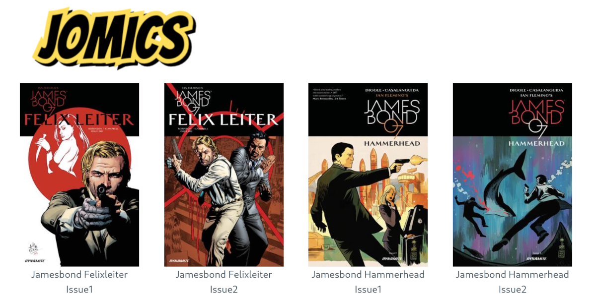

# Jomics

Jomics is a simple comic reader server.

Features:
 * Supports `cbz` and `cbr`.
 * Basic `ComicInfo.xml` support  (Probably it can be developed further.)
 * Folders.
 * No configuration files, no databases, no webservers etc.
 * The only dependencies is libc and the kernel.
 * Periodically rescans comic directory.




## Installation

You need the golang toolchain version 1.16 or newer. Then clone the repo, and run

`go get && go build`

All data will be embedded into the `jomics` binary. It is not possible to build
jomics free of libc dependencies due to build constraints in the `go-unarr` package.
`go-unarr` is used to read cbr and cbz.

## Usage
```
Usage of ./jomics:
  -addr string
        Server address.
        Set to ":4531" if you want jomics to be reachable from other computers. (default "localhost:4531")
  -light
        Light CSS theme. Default is dark.
  -q    Quiet. No prints when new comics are discovered.
  -root string
        Comic collection root.
  -si int
        Rescan collection interval. Zero or negative to disable. (default 300)
  -th int
        Front page thumb nail size. (default 400)
  -webroot string
        For reverse proxy servers use.
```
When jomics starts it will start with generate front cover thumb nails of all new album.
If you change the thumb nail size, new thumb nails will be generated.
Then point your favorite browser to `localhost:4531`.

## Security
There is none. It is just a comics reader server.

## Privacy
No personal data is stored by jomics, neither server side nor as cookies ETC on the client.
Jomics behaves precisely as physical comic albums. (Except that the comic albums are sorted alphabetical when
presented.) You have to book mark where you are if you can't remember, and you have to sort your albums yourself
into different shelves (directories) as well.

## Third party packages
 * The folder icon is taken from http://www.clker.com/clipart-simple-file-folder.html (resized & included)
 * The CSS framework used https://picocss.com/ (included as zip)
 * http://github.com/OpenPeeDeeP/xdg for cache directory.
 * http://github.com/disintegration/imaging is used to resize images.
 * http://github.com/gen2brain/go-unarr for uncompressing zip and rar archives.
 * http://github.com/spectrumjade/zipfs to embed picocss as zip

## Future plans
Currently jomics is feature complete. I have no plans to add any features, but it might change once I've used jomics for some time.

## License
MIT
