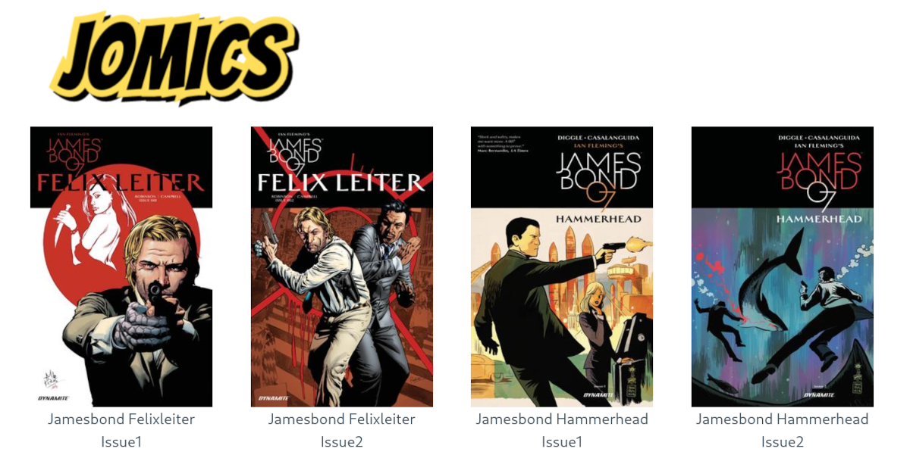

# Jomics

Jomics is a simple comic reader server.

Features:
 * Supports cbz and cbr
 * Basic `ComicInfo.xml` support  (Probably it can be developed further.)
 * Folders
 * No configuration files, no databases, no webservers etc.
 * The only dependencies is libc and the kernel.



## Installation

You need the golang toolchain version 1.16 or newer. Then clone the repo, and run

`go get && go build`

All data will be embedded into the `jomics` binary. It is not possible to build
jomics free of libc dependencies due to build constraints in the `go-unarr` package.
`go-unarr` is used to read cbr and cbz.

## Usage
```
  Usage of ./jomics:
    -addr string
          Server address. (default ":4531")
    -root string
          Comic collection root.
    -th int
          Front page thumb nail size. (default 400)
```
jomics will start with generating thumb nails of all album covers. It will take some time.
If you change the thumb nail size, new thumb nails will be generated.
Then point your favorite browser to `localhost:4531` if you are using the address.

## Security
There is none. It is just a comics reader server.

## Third party packages
 * The folder icon is taken from http://www.clker.com/clipart-simple-file-folder.html (resized & included)
 * The CSS framework used https://picocss.com/ (included)
 * http://github.com/OpenPeeDeeP/xdg for cache directory.
 * http://github.com/disintegration/imaging is used to resize images.
 * http://github.com/gen2brain/go-unarr for uncompressing zip and rar archives.

## Future plans
Currently jomics is feature complete. I have no plans to add any features, but it might change once I've used jomics for some time.

## License
MIT

